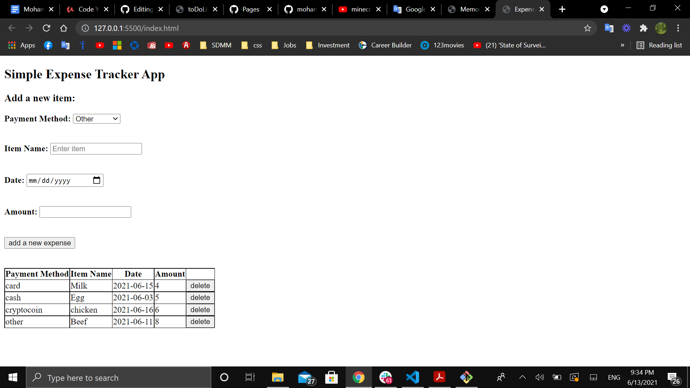

# Vanilla JavaScript Expense-Tracker-App 

#### A simple Expense-Tracker-App game written entirely in Javascript, HTML, and CSS.

#### Play it [here](https://mohammedq91.github.io/Expense-Tracker-App/)

## Summary

This project helped me further to grasp my understanding of JavaScript fundamentals. Also, I learned how to return an element from a list.

## Author

- **Mohammed Qaralos** - *Self taught Software Developer* - [Website](http://127.0.0.1:5500/index.html) | [LinkedIn](https://www.linkedin.com/in/mohammed-qaralos-27151010a/)
